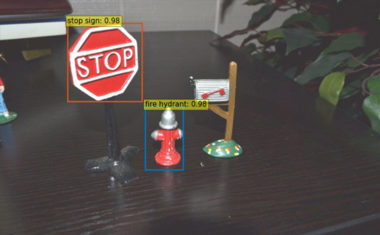

# Fine-tuning Detection Transformer (DERT)

The mainly purpose of this repository is to fine-tune Facebook's [DERT](https://github.com/facebookresearch/detr) (DEtection Transformer). 

Author: Doramas Báez Bernal  
Email: doramas.baez101@alu.ulpgc.es

## Index

* [Introduction](#Introduction)
* [Requirements](#Requirements) 
* [Detection Transformer (DERT)](#Dert)
    * [General information](#GeneralInformation)
    * [Fine-tuning](#Fine-tuning)
* [References](#References)

## Introduction 

## Requirements 

## Detection Transformer (DERT) 

### General information (DERT) 

### Fine-tuning 

## References  