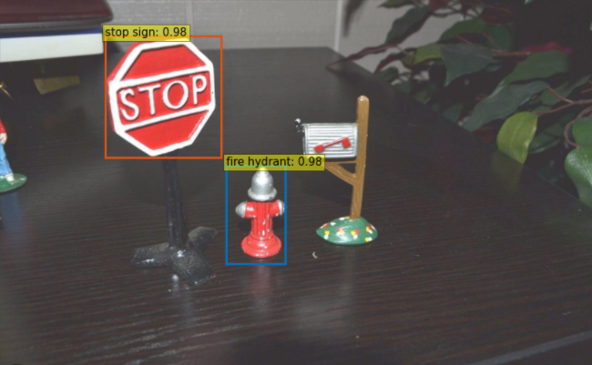
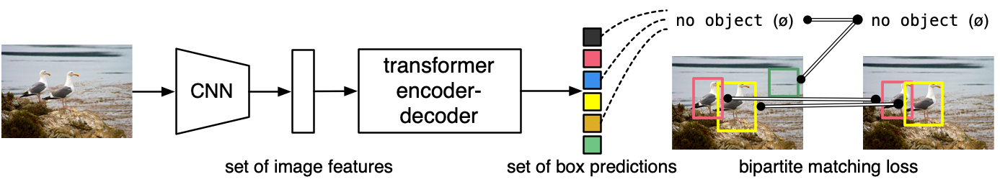
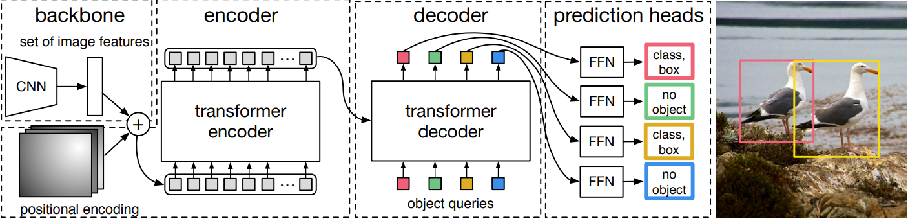
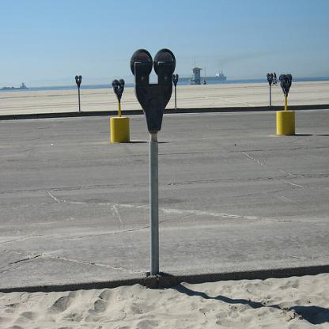
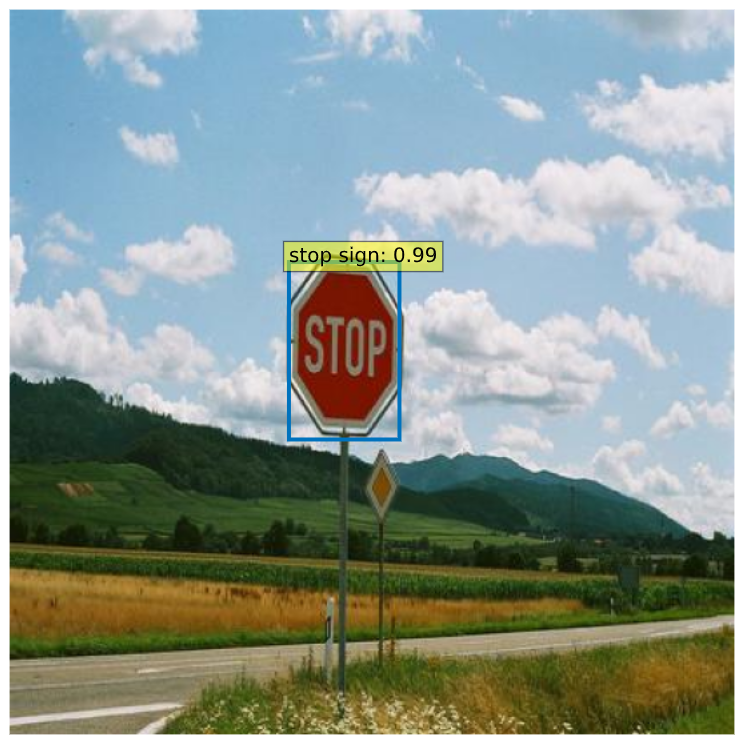
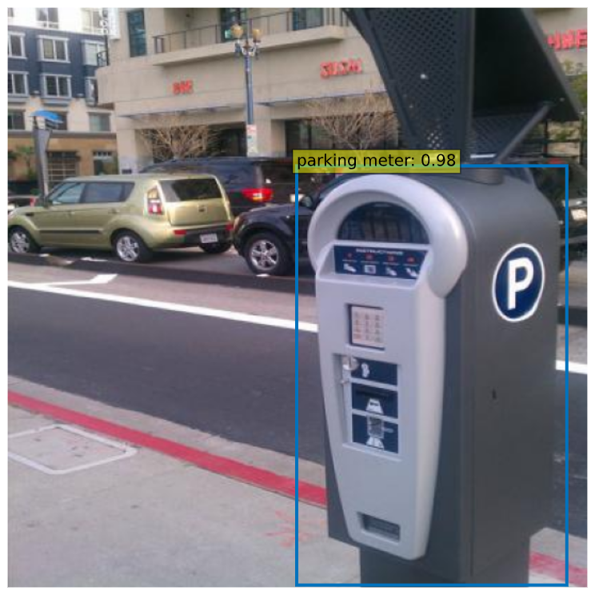

# Fine-tuning Detection Transformer (DERT)

The main purpose of this repository is to fine-tune Facebook's [DERT](https://github.com/facebookresearch/detr) (DEtection Transformer). 





Author: Doramas Báez Bernal <br/>
Email: doramas.baez101@alu.ulpgc.es

## Index

* [Introduction](#Introduction)
* [Requirements](#Requirements) 
* [Detection Transformer (DERT)](#Dert)
    * [General information](#GeneralInformation)
    * [Fine-tuning](#Fine-tuning)
    * [Results](#Results)
* [References](#References)

## Introduction <a id="Introduction"></a>

Unlike traditional computer vision techniques, DETR approaches object detection as a direct set prediction problem. It consists on a set-based global loss, which forces unique predictions via bipartite matching, and a Transformer encoder-decoder architecture. Given a fixed small set of learned object queries, DETR reasons about the relations of the objects and the global image context to directly output the final set of predictions in parallel. Due to this parallel nature, DETR is very fast and efficient ([paper](https://arxiv.org/abs/2005.12872)).

## Requirements <a id="Requirements"></a>

This section indicates the main dependencies of the project:

- torch>=1.5.0
- torchvision>=0.6.0
- pycocotools

Also, **it is necessary** to download the following directories:
- [Dataset](https://drive.google.com/drive/folders/1Z2RUfz8KP10lM3fk8sNSdPaMc0e5ll8D?usp=sharing) for the fine-tuning
- [Checkpoints](https://drive.google.com/drive/folders/1Z2RUfz8KP10lM3fk8sNSdPaMc0e5ll8D?usp=sharing) of the model after fine-tuning

Therefore, the project must have the following structure:

```
path/to/DERT-finetune/
├ dert.ipynb            # dert notebook
├ train_custom_coco/    # folder containing dataset for fine-tuning
│   ├ annotations/        # annotation json files
│   ├ image_test/         # Images for testing after fine-tuning
│   ├ train2017/          # train images
│   └ val2017/            # val images
├  outputs/              
│   └ checkpoint.pth      # checkpoint of the model
└  data/                 
    ├ dert_finetune/      # DETR to fine-tune on a dataset
    └ images/             # Images for the readme
```

## Detection Transformer (DERT) <a id="Dert"></a>

### General information (DERT) <a id="GeneralInformation"></a>



DETR directly predicts (in parallel) the final set of detections by combining
a common CNN with a transformer architecture. During training, bipartite matching uniquely assigns predictions with ground truth boxes. Prediction with no match should yield a “no object” (∅) class prediction. So, they adopt an enconder-decoder architecture based on transformers, a popular architecture for sequence prediction. Applying this architecture and using the concept of self-attention, this architecture is able to predict all objects at once, and is trained end-to-end with a set loss function which performs bipartite matching between predicted and ground-truth objects.

The next thing to be discussed is the architecture in detail:



In the previous figure it can be seen that, DETR uses a conventional CNN backbone to learn a 2D representation of an input image. Then, the model flattens it and supplements it with a positional encoding before passing it into a transformer encoder (this will be the input of the encoder). A transformer decoder then takes as input a small fixed number of learned positional embeddings, which we call object queries, and additionally attends to the encoder output. Finally, each output embedding is passed to a shared feed forward network (FFN) that predicts either a detection (class
and bounding box) or a “no object” class.

### Fine-tuning <a id="Fine-tuning"></a>

For the fine-tuning a [dataset]((https://drive.google.com/drive/folders/1Z2RUfz8KP10lM3fk8sNSdPaMc0e5ll8D?usp=sharing)) has been prepared. This dataset contains approximately 900 images belonging to a larger dataset, the coco dataset. In this case, the subset consists of 3 classes:

- fire hydrant
- parking meter
- stop sign

Example of the images used:

 


## Results <a id="Results"></a>

The following results have been obtained by adapting the model weights (fine-tuning) for 30 epochs:

 

## References <a id="References"></a> 

- Official repositories:
    - Facebook's [DERT](https://github.com/facebookresearch/detr) ([paper](https://arxiv.org/abs/2005.12872))  
    - Facebook's [detectron2 wrapper for DERT](https://github.com/facebookresearch/detr/tree/master/d2)
    - [DERT checkpoints](https://github.com/facebookresearch/detr#model-zoo): for the fine-tune, we will remove the classification head.

- Requirements:
    - [Dataset](https://drive.google.com/drive/folders/1Z2RUfz8KP10lM3fk8sNSdPaMc0e5ll8D?usp=sharing) for fine-tune DERT  
    - The last [checkpoint](https://drive.google.com/drive/folders/1Z2RUfz8KP10lM3fk8sNSdPaMc0e5ll8D?usp=sharing) (inside outputs folder)

- Special mention:
    - Build your own [dataset](https://roboflow.com/)  
    - Example of [fine-tuning dert](https://github.com/woctezuma/finetune-detr) by  [woctezuma](https://github.com/woctezuma)
    - [Fork](https://github.com/woctezuma/detr/tree/finetune) of DERT prepared to fine-tune on custom dataset by [woctezuma](https://github.com/woctezuma)

- Official notebooks:
    - An [official notebook](https://colab.research.google.com/github/facebookresearch/detr/blob/colab/notebooks/detr_attention.ipynb) ilustrating DERT
    - An [official notebook](https://colab.research.google.com/github/cocodataset/cocoapi/blob/master/PythonAPI/pycocoDemo.ipynb) for using COCO API


- Tutorials:
    - A [Github Gist](https://gist.github.com/woctezuma/e9f8f9fe1737987351582e9441c46b5d) explaining how to fine-tune DERT  
    - A [Github issue](https://github.com/facebookresearch/detr/issues/9#issuecomment-636391562) explaining how to load a fine-tuned DERT 
